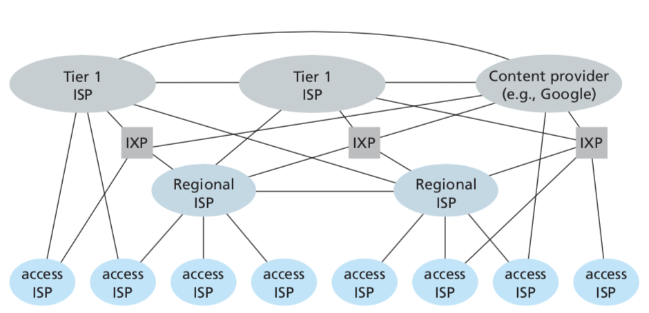
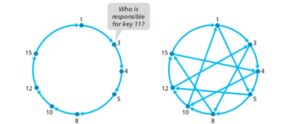
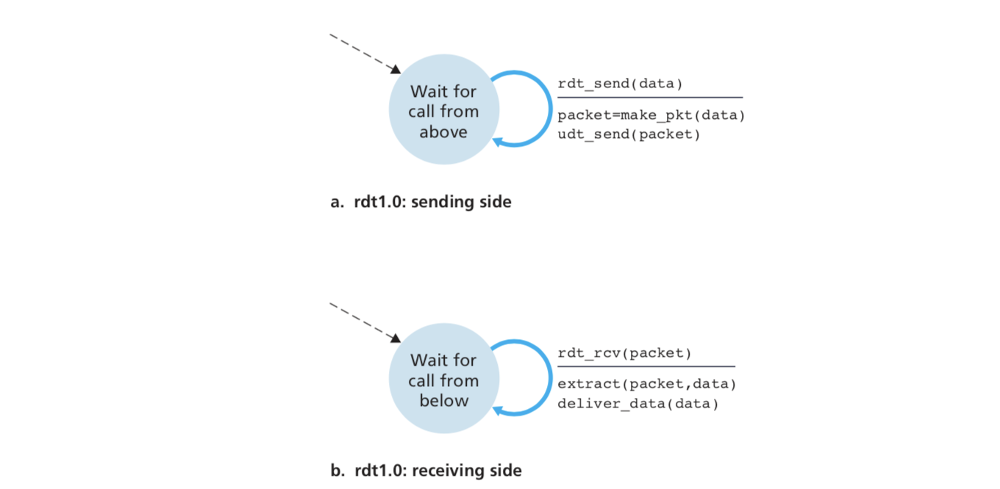
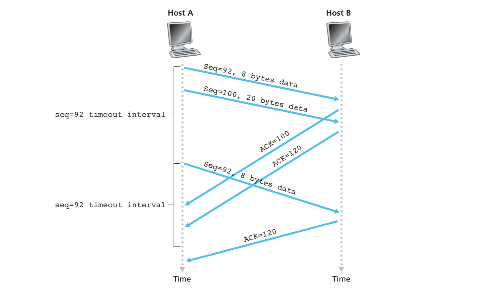
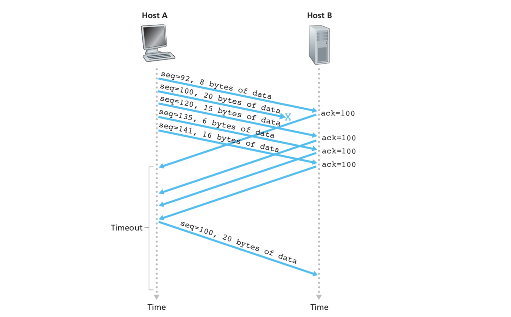
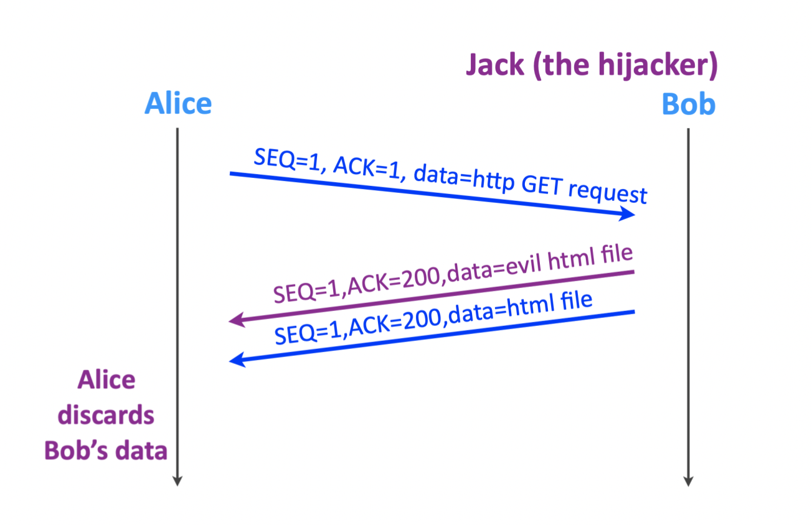
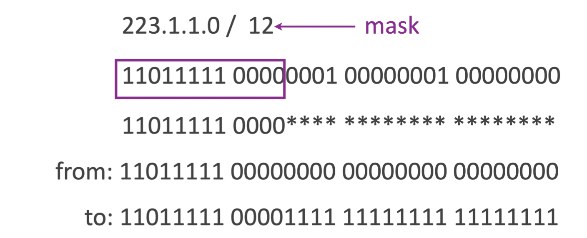
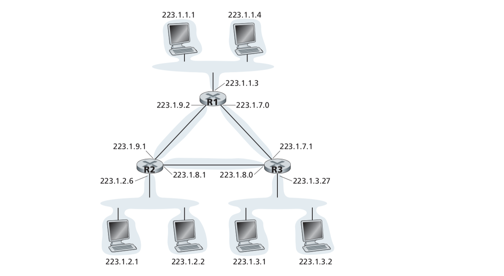
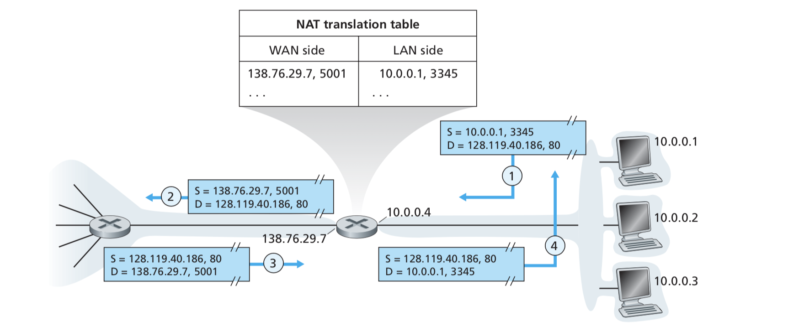
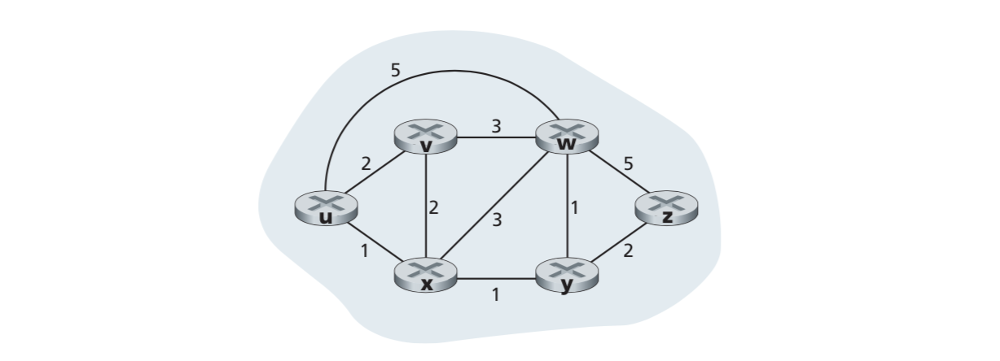

# The internet and Computer Networks 

The internet is a computer network that interconnects many devices such as computer, mobile phones, TV, gaming consoles, servers and wearables (and many more!), throughout the world. All these devices are called **hosts** or **end systems**. Hosts are all connected with **communication links** and **packet switches** (most commonly routers and link-layer switches).  
End systems access the internet through **internet service providers** (ISPs).


## What is the internet made of?

All end systems on the network are connected to the internet with direct links and switches. Let's zoom in and explore the direct link between our machine and a network switch.

### Digital Subscriber line


A residence obtains DSL access from the local telephone company. A DSL modem uses the existing telephone line to exchange data with a digital subscriber line access multiplexer (DSLAM). Telephone lines are made of twisted copper wire containing three different channels: a downstream data channel, an upstream data channel and a 2-way phone channel.  
From an infrastructural point of view, we use telephone lines to avoid having to lay down new infrastructure while we can make use of the existing one.

### Cable internet access

Similarly to DSL, cable internet access makes use of the existing cable television infrastructure. However, unlike DSL, there is no direct link to the switch. Instead, each end system is connected to a neighbourhood-level junction using coaxial copper wiring which is then connected to a cable modem termination system (CMTS) with fibre. It is a shared broadcast medium.

### Other access types

There are many other types of service providers. We can mention universities, cellular, satellite, fibre to the home. The key question to ask when trying to provide a population with internet access is whether or not we can use physical infrastructure that is already available. 

## Who owns and manages the internet ?

We know that ISPs provide access to our devices and end-systems. However, the internet's structure is much more complex that having a direct link between the ISP and the host. The goal is to achieve interconnectivity between ISP so that all end systems can communicate with each other. However, linking all ISPs together would be very costly. The structure that is in place today is a three-tier hierarchy, called network structure 5. It consists of access ISPs, regional or global ISPs and tier 1 ISPs. There exists a customer-provider relationship at all levels of the hierarchy: customers pay the provider for access. ISPs at the same level can have a peering agreement so that all the traffic between them passes through a direct link rather than the level above. Also, there are Internet Exchange Points (IXPs) which are meeting points for the ISPs to interconnect. Lastly, there are emerging **content provider networks**, like Google, that connect directly (or via an IXP) to access ISPs to bypass upper tiers.



## How does communication happen ?

The internet is organised around a specific layered architecture. Every layer has its protocol(s) and well-defined interfaces to upper/lower layers. Protocols of various layers are called the **protocol stack**.

1. *The application layer* includes protocols such as HTTP, SMTB and FTP. An application-layer protocol is distributed over multiple end systems, with the application in one end system using the protocol to exchange packets of information with the application in another end system. Information exchanged at this layer will be referred to as a **message**.
2. *The transport layer* transports application-layer messages between application endpoints. There are two transport protocols: TCP and UDP. A transport-layer packet is referred to as a **segment**.
3. *The network layer* includes the IP protocol. All Internet components that have a network layer must run the IP protocol. It also includes many routing protocols. It is often called the IP layer. A network-layer packet is referred to as a **datagram**.
4. *The link layer* is responsible to deliver packets from transmitting node to receiving node in a reliable way. A link-layer packet is referred to as a **frame**.
5. *The physical layer* has to move individual bits within the frame from the link layer, from one node to the next. The protocols on this layer depends on the actual transmission medium of the link.

At the sending host, when the application-layer message is passed to the transport layer, that layer takes the message and appends additional information (transport-layer header information) that will be used by the receiving-side transport layer. The transport-layer encapsulates the application-layer message, and then passes it to the network layer which adds network-layer header information, creating a network-layer datagram, and so on. On the receiving side, each layer will decapsulate the corresponding header information.

## How do we communicate over a network ?

In a network application, end systems exchange messages with each other. To send a message to a destination, the source breaks that messages into smaller chunks of data known as **packets**. To reach the destination, each packet travels from the source through communication links and **packet switches**.  
A switch contains a buffer used to store the data and a forwarding table used to store metadata and indicate where to send the data. In order to send incoming packets to their destination efficiently, we must use resource management. 

### Treating packets on demand: packet switching

In this case, incoming packets are stored in the buffer and then sent to their destination. However, when the buffer becomes full, the switch cannot handle more packets, and the incoming packets are lost. We say packets are treated on demand, and that admission control & forwarding decisions are made per packet. 

### Reserve resources in advance

In this case, we can call this "connection switching", the source asks the switch to reserve resources in advance. On each packet, the source writes a unique identifier so that the switch can recognise it. However, if the source goes silent, the resources are still reserved, and other sources cannot use it. We say resources are reserved per active connections, and that admission control & forwarding decisions are made per connection.

Packet switching makes an efficient use of ressources, but has an unpredictable performance. On the other hand, "connection switching" has a predictable performance and makes an inefficient use of ressources.  
Today's internet uses packet switching. It is easier to implement, but requires congestion control.  

**Congestion control** uses statistical multiplexing in order to manage the available resources. It uses statistical data on user activities and predicts their behaviour to know how to allocate resources. 


## Measuring network performances

We use the following metrics to measure the performance of a network.

### Packet loss

Packet loss consists of the fraction of the packets sent from a source that were dropped before reaching their destination.

### Packet delay (latency)

Packet delay consists of the time needed to send a packet from its source to its destination. A packet goes through the following processes:

- Transmission: bits pushed into a link one by one 
- Propagation: bits travel along a link 
- Queuing: packets wait to be processed
- Processing: packet is being processed

During each of the above steps, a delay is introduced. 

#### Transmission delay 

If the length of the packet is L bits, and the **transmission rate** of the link is R bits/sec, then the 
**transmission delay** is L/R. This is the amount of time required to push (transmit) all of the packet's bits into the link. Typically on the order of microseconds to milliseconds.

#### Propagation delay

**Propagation delay** is the time required to push all the bits from the beginning of the link to the next switch. The bit propagates at the propagation speed of the link, which depends on the link's physical medium. The propagation delay is the distance between the two switches divided by the propagation speed of the link.

#### Queuing delay

At the queue, a packet experiences **queuing delay** as it waits to be transmitted on the link. It depends on the number of packets that have arrived earlier. If the queue is empty, the queuing delay will be 0.  
The queuing delay is characterised with statistical measures such as the average queuing delay, the variance of the queuing delay, and the probability that it exceeds a certain value. It also depends on the traffic pattern: the arrival rate at the queue, the nature of incoming traffic and the transmission rate of the outgoing link.  
If the  bit arrival rate is larger than the bit departure rate, then the queuing delay approaches infinity. Otherwise, it depends on burst size.

#### Processing delay

The **processing delay** consists of the time required to examine the packet's header and determine where to direct the packet.

### Throughput

Another critical performance measure is end-to-end throughput. The **instantaneous throughput** at any time is the rate (in bits/sec) at which the host is receiving the file. If the file consists of F bits and and the transfer takes T seconds for the host to receive the file, the the **average throughput** of the file transfer is F/T bits/sec. For a simple two-link network, the throughput is the transmission rate of the **bottleneck link**.

### Security

Here, we measure the ability of the network to react to adversarial behaviour.

#### Malware

Among all the files on the Internet, we are sometimes exposed to **malware**. Once malware infects our device, it can do all kinds of bad things such as deleting files, sending emails, installing spyware...  
Most malware nowadays is self-propagating. It can spread in the form of a virus or of a worm. **Viruses** require some sort of user interaction to infect a device. **Worms** can infect a device without any explicit interaction (i.e from a network application).

#### Denial of Service attacks

A DoS attack renders a network, host or other piece of infrastructure unusable by legitimate users. DoS attacks fall under three categories:

- Vulnerability attack: well crafted messages are sent to a vulnerable application or operating system on a target host. If the right sequence of packets are sent, the service can stop or the host might crash.
- Bandwidth flooding: the attacker sends a deluge of packets to the targeted host so that the target’s access link becomes clogged, preventing legitimate packets from reaching the server.
- Connection flooding: a large number of TCP connections are established at the target host. The host can become so bogged down by the bogus connections that it stops accepting legitimate connections.

In a distributed DoS attack (**DDoS**) the attacker controls multiple sources that each blast traffic at the target. 

#### Sniffing

A packet sniffer is a passive receiver that records a copy of every packet that passes through the network. Because they are passive, sniffers are hard to detect. 

#### Spoofing

Spoofing is the ability to inject packets into the internet with a false source address. To solve this we will need end-point authentication. 

# Application Layer

In a network, two different end systems communicate using processes at the application layer. A **process** is a piece of code that belongs to the application layer.  
Before diving into software coding, one should have a broad architectural plan for a network application: it dictates how to application is structured over different end systems.  

## Network applications architectures

An application developer will likely draw on one of the two predominant architectural paradigms used in modern applications: the **client-server** architecture or the **peer-to-peer** architecture. 

### The client-server architecture 


In a client-server architecture, there is an always-on host, called the **server**, which services requests from many other hosts called **clients**. With this architecture, the clients don't directly communicate with each other. Another characteristic is that the server has a fixed IP address. Since the server is always on and has a fixed address, the client can always contact the server by sending a packet to the server's IP address.

Often in a client-server application, the server is incapable of keeping up with all the requests from clients. For this reason, a **data center**, housing a large number of hosts, is often used to create a powerful virtual server. 

### The peer-to-peer architecture

In a peer-to-peer architecture there is very little or no reliance on dedicated servers in data centres. Instead the application exploits direct communication between pairs of intermittently connected hosts, called **peers**. The peers are not owned by service providers, but are instead desktops and laptops controlled by users, with most of the peers residing in homes, universities or offices.

Most of today's traffic-intensive applications are based on P2P architectures: file sharing (BitTorrent), internet telephony (Skype), IPTV...

One of the most compelling features of a peer-to-peer architecture is self-scalability. In a P2P file-sharing application, even though each peer generates workload by requesting files, each peer also adds service capacity to the system by distributing files to other peers. Also, P2P architectures are cost effective since they don't require significant server infrastructure. 

Future P2P applications face three major challenges:

1. **ISP Friendly**: most residential ISPs have been dimensioned for asymmetrical bandwidth usage, that is, for much more downstream traffic than upstream traffic. But P2P video streaming and file distribution applications shift upstream traffic from servers to residential ISPs, thereby putting significant stress on the ISPs.
2. **Security**: because of their highly distributed and open nature, P2P applications can be a challenge to secure.
3. **Incentives**: the success of future P2P applications also depends on convincing users to volunteer bandwidth, storage, and computation resources to the applications, which is the challenge of incentive design.


## Network application transport services

Processes on two different end systems communicate with each other by exchanging messages across the computer network. A sending process creates and sends messages into the network; a receiving process receives these messages and possibly responds by sending messages back.
 
When a process delivers or receives a message to/from the transport layer, some delivery guaranties are needed: this is the goal of a transport-layer protocol.
How to choose among the available transport-layer protocols? We need to study the services offered by that protocol and then pick the one that best matches our application's needs.

We can classify the possible services along four dimensions: reliable data transfer, throughput, timing, and security.

### Reliable data transfer

As seen earlier, a packet can get lost within a network. For many applications such as document transfers, financial transactions and e-mail, data loss can have devastating consequences. To support these applications, something has to be done to guarantee that the data sent by one end of the application is delivered correctly and completely to the other end of the application. If a protocol does so, we say it offers **reliable data transfer**. 
 
When a transport-layer protocol doesn't offer reliable data transfer, some data sent by the sending process may never arrive and the receiving process. This may be acceptable for loss-tolerant applications such as conversational audio/video or online streaming where lost data might result in a small glitch in the audio/video—not a crucial impairment.

### Throughput

Multiple sessions will be sharing the bandwidth along the network path, and because these other sessions will be coming and going, the available throughput can fluctuate with time. These observations led to another natural service that a transport-layer protocol could provide, namely, guaranteed available throughput at some specified rate. Such a guaranteed throughput service would appeal to many applications that have throughput requirements, known as **bandwidth-sensitive applications**.

### Timing

A transport-layer protocol can also provide timing guarantees. Such a service would be appealing to interactive real-time applications, such as Internet telephony, virtual environments, teleconferencing, and multiplayer games, all of which require tight timing constraints on data delivery in order to be effective. For non-real-time applications, lower delay is always preferable to higher delay, but no tight constraint is placed on the end-to-end delays.

### Security

A transport protocol can provide an application with one or more security services: providing confidentiality between the two processes, data integrity and end-point authentication.

## Transport services provided by the internet

The Internet makes two transport protocols available to applications, UDP and TCP. When an application developer creates a new network application for the Internet, one of the first decisions he has to make is whether to use UDP or TCP. 

### TCP services

The TCP service model includes a **connection-oriented** service and a **reliable data transfer** service. When an application invokes TCP as its transport protocol, the application receives both of these services from TCP.

**Connection oriented service**: TCP has the client and server exchange transport-layer control information with each other before the application-level messages begin to flow. This so-called **handshaking procedure** alerts the client and server, allowing them to prepare for an onslaught of packets. When the application finishes sending messages, it must tear down the connection. We say TCP is "stateful", in a way it maintains state on communicating processes.

### UDP services


UDP is a no-frills, lightweight transport protocol, providing minimal services. It is **connectionless** or "stateless": there is no handshaking before the two processes start to communicate. UDP provides an **unreliable data transfer** service.

### Services not provided by UDP and TCP

TCP and UDP provide no performance guarantees. Concerning security guarantees, it's complicated. We use a **Secure Socket Layer** (**SSL**),  a library that implements a bunch of security ready functions (encrypt, decrypt, check integrity).

## Example: the web

The **HyperText Transfer Protocol** (**HTTP**), the Web’s application-layer protocol, is at the heart of the Web. It is implemented in two programs: a client program and a server program. The client program and server program, executing on different end systems, talk to each other by exchanging HTTP messages. HTTP defines the structure of these messages and how the client and server exchange the messages. 

### Web pages

A webpage is a collection of objects. An object is just a file (it can be an HTML file, a Java applet, a JPEG image...) addressable by a single URL. Most web pages consist of a **base HTML file** and several referenced objects. 

HTTP defines how Web clients request Web pages from Web servers and how servers transfer Web pages to clients. There are few possible types of HTTP requests, 

- GET: client requests to download a file
- HEAD: client requests file metadata
- POST: client provides information
- PUT: client requests to upload a file
- DELETE: client requests to delete a file

and a few possible types of HTTP responses: OK, Not Found, Moved permanently, Bad request. Because an HTTP server maintains no information about the clients, HTTP is said to be a **stateless protocol**.

### Non-Persistent and Persistent Connections

When a client-server interaction is taking place over TCP, the application developer needs to make an important decision––should each request/response pair be sent over a separate TCP connection, or should all of the requests and their corresponding responses be sent over the same TCP connection? In the former approach, the application is said to use **non-persistent connections**; and in the latter approach, **persistent connections**.

In the case of **non-persistent connections**, a TCP connection is required to transfer one object (one request message and one response message). After the object is received, the connection is closed. 


The time needed to send one object over the network is two Round Trip Time (RTT) plus the transmission time at the server of the HTML file.

In the case of **persistent connections**, the server leaves the TCP connection open after sending a response. Subsequent requests and responses between the same client and server can be sent over the same connection: an entire webpage can be sent over the same persistant TCP connection. Requests for objects can be made back-to-back, without waiting for replies to pending requests. Typically, the HTTP server closes a connection when it isn’t used for a certain time (a configurable timeout interval).

The default mode of **HTTP uses persistent connections with pipelining**. 

### User-Server Interaction: Cookies

We mentioned that an HTTP server is stateless. This simplifies server design and has permitted engineers to develop high-performance Web servers that can handle thousands of simultaneous TCP connections.  
However, it is often desirable for a website to identify users, either because the server wishes to restrict user access or because it wants to serve content as a function of the user identity. For this purpose, HTTP uses **cookies**. Cookies allow sites to keep track of users.


Cookies can thus be used to create a user session layer on top of stateless HTTP. Although cookies often simplify the Internet experience for the user, they are controversial because they can also be considered as an invasion of privacy.

### Web Caching 

A **web cache**—also called a **proxy server**—is a network entity that satisfies HTTP requests on the behalf of an origin web server. The web cache has its own disk storage and keeps copies of recently requested objects in this storage.

Suppose a browser is requesting an object. Here is what happens:

1. The browser establishes a TCP connection to the Web cache and sends an HTTP request for the object to the web cache.
2. The web cache checks to see if it has a copy of the object stored locally. If it does, the web cache returns the object within an HTTP response message to the client browser.
3. If the web cache does not have the object, the Web cache opens a TCP connection to the origin server. The Web cache then sends an HTTP request for the object into the cache-to-server TCP connection. After receiving this request, the origin server sends the object within an HTTP response to the web cache.
4. When the web cache receives the object, it stores a copy in its local storage and sends a copy, within an HTTP response message, to the client browser (over the existing TCP connection between the client browser and the Web cache).

Web caching is useful for two reasons. First, it can substantially reduce the response time for a client request. If there is a high-speed connection between the client and the cache, as there often is, and if the cache has the requested object, then the cache will be able to deliver the object rapidly to the client. Second, Web caches can substantially reduce traffic on an institution’s access link to the Internet.

Unfortunately, the copy of an object residing in the cache can be stale. HTTP has a mechanism that allows a cache to verify that its objects are up to date. This mechanism is called the **conditional GET**.

## Example: P2P application (BitTorrent)

In a P2P architecture, there is minimal (or no) reliance on always-on infrastructure servers. Instead, pairs of intermittently connected hosts, called peers, communicate directly with each other. The peers are not owned by a service provider, but are instead desktops and laptops controlled by users.

### File Distribution

In P2P file distribution, each peer can redistribute any portion of the file it has received to any other peers, thereby assisting the server in the distribution process.

Consider a simple quantitative model for distributing a file to a fixed set of peers for both architecture types.
Denote the upload rate of the server’s access link by *u_s*, the upload rate of the i\_th peer’s access link by *u\_i*, and the download rate of the i\_th peer’s access link by *d_i*. Also denote the size of the file to be distributed (in bits) by *F* and the number of peers that want to obtain a copy of the file by *N*.

Let’s first determine the distribution time for the client-server architecture, which we denote by *D_cs*:

- The server must transmit one copy of the file to each of the *N* peers. Thus the server must transmit *NF* bits. Since the server’s upload rate is *u_s*, the time to distribute the file must be at least *NF/u_s*.
- Let *d_min* denote the download rate of the peer with the lowest download rate, that is, `dmin = min{d1,dp,...,dN}`. The peer with the lowest download rate cannot obtain all F bits of the file in less than *F/d_min* seconds. Thus the minimum distribution time is at least *F/d_min*.


Let’s now go through a similar analysis for the P2P architecture:

- At the beginning of the distribution, only the server has the file. To get this file into the community of peers, the server must send each bit of the file at least once into its access link. Thus, the minimum distribution time is at least *F/u_s*.
- As with the client-server architecture, the peer with the lowest download rate cannot obtain all F bits of the file in less than *F/d_min* seconds. Thus the minimum distribution time is at least *F/d_min*. 
- Finally, observe that the total upload capacity of the system as a whole is equal to the upload rate of the server plus the upload rates of each of the individual peers, that is, `u_total = u_s + u1 + ... + uN`. The system must deliver (upload) *F* bits to each of the *N* peers, thus delivering a total of *NF* bits. This cannot be done at a rate faster than *u_total*. Thus, the minimum distribution time is also at least NF/(u_s + u1 + ... + uN).


Therefore, applications with the P2P architecture can be self-scaling. This scalability is a direct consequence of peers being redistributors as well as consumers of bits. In other words, a peer-to-peer architecture scales better than a client-server architecture.


### File retrieving

The following steps are followed to retrieve content from a peer-to-peer file distribution system:

- Get the metadata file and read data file IDs
- Find data file locations
	- Ask tracker, or
	- Ask distributed hash table (DHT)
- Get datas file from peers 

A **tracker** is an end-system that knows the IP addresses of the peers that store a file.

A **DHT** is a distributed system that knows the IP addresses of the peers that store a file. Many end-systems work together to answer a question: one DHT member may not know the answer, but can redirect you toward another member who does know it. 

The **metadata file** can either be on a web server or on a peer. If it's on a peer, you learn its ID from a web server and its location from a tracker or a DHT.

### Distributed Hash Table

A DHT is a distributed database which stores (key, value) pairs. In this case, a key is the content name and the value is the IP address of a peer that has a copy of the content. In the P2P system, each peer will only hold a small subset of the totality of the (key, value) pairs.

Each peer (value) has an integer identifier, and so does content names (keys). Peers are then organised in a circle so that each peer only keeps track of its immediate successor and immediate predecessor.



If peer 3 is asked about key 11, it will forward the request to its the neighbour closest to destination, and so until an answer is received. 

## Domain Name System

End-hosts are identified by **hostnames**. Hostnames such as *google.com* or *epfl.ch* are mnemonics and are therefore appreciated by humans. On the other hand, we know hosts are also identified by IP addresses.  
People refer to hosts with their hostnames and routers with their IP addresses.
The Domain Name System translates hostnames to IP addresses. 

The DNS is a **distributed database** implemented in a hierarchy of DNS servers, and an **application-layer protocol** that allows hosts to query the distributed database. 

In order to go on the epfl website:

1. The user machine runs the client side of the DNS application.
2. The browser extracts the hostname, www.epfl.ch, from the URL
and passes the hostname to the client side of the DNS application.
3. The DNS client sends a query containing the hostname to a DNS server.
4. The DNS client eventually er a reply, which includes the IP address for
the hostname.
5. Once the browser receives the IP address from DNS, it can initiate a TCP connection to the HTTP server process located at port 80 at that IP address.

### How DNS works

A centralised database in a single DNS server simply doesn’t scale: it would represent a single point of failure, experience huge traffic volumes, be far from some clients and require lots of maintenance. 


In reality, DNS uses a large number of servers organised in a hierarchical fashion and distributed around the world. No DNS server has all the mappings for all the hosts on the internet. Instead, the mappings are distributed across the DNS servers. There are three classes of DNS servers—root DNS servers, top-level domain (TLD) DNS servers, and authoritative DNS servers. 

DNS uses the **UDP protocol**, because it is faster than initiating TCP connections at each requests.


#### Root DNS servers

In the Internet there are 13 root DNS servers, most of which are located in North America. Although we have referred to each of the 13 root DNS servers as if it were a single server, each “server” is actually a network of replicated servers, for both security and reliability purposes. 

#### Top-level domain (TLD) servers

These servers are responsible for top-level domains such as com, org, net, edu, and gov, and all of the country top-level domains such as uk, fr, ca, and jp.

#### Authoritative DNS servers

Every organisation with publicly accessible hosts (such as Web servers and mail servers) on the Internet must provide publicly accessible DNS records that map the names of those hosts to IP addresses. An organisation’s authoritative DNS server houses these DNS records.

#### Local DNS servers

There is another important type of DNS server called the local DNS server. A local DNS server does not strictly belong to the hierarchy of servers but is nevertheless central to the DNS architecture.  

When a host connects to an ISP, the ISP provides the host with the IP addresses of one or more of its local DNS servers. When a host makes a DNS query, the query is sent to the local DNS server, which acts a proxy, forwarding the query into the DNS server hierarchy.

When trying to reach an endhost, say `www.epfl.ch`, the host first sends a DNS query message to its local DNS. The query message contains the hostname to be translated, namely, `www.epfl.ch`. The local DNS server forwards the query message to a root DNS server. The root DNS server takes note of the `ch` suffix and returns to the local DNS server a list of IP addresses for TLD servers responsible for `ch`. The local DNS server then resends the query message to one of these TLD servers. The TLD server takes note of the `epfl.ch` suffix and responds with the IP address of the authoritative DNS server for EPFL. Finally, the local DNS server resends the query message directly to the `epfl.ch` DNS server, which responds with the IP address of `www.epfl.ch`. 

In general, the query from the requesting host to the local DNS server is **recursive**, and the remaining queries are **iterative**.

### DNS caching

DNS extensively exploits **DNS caching** in order to improve the delay performance and to reduce the number of DNS messages ricocheting around the Internet. 

In a query chain, when a DNS server receives a DNS reply (containing, for example, a mapping from a hostname to an IP address), it can cache the mapping in its local memory.  
If a hostname/IP address pair is cached in a DNS server and another query arrives to the DNS server for the same hostname, the DNS server can provide the desired IP address, even if it is not authoritative for the hostname.  
Because hosts and mappings between hostnames and IP addresses are by no means permanent, DNS servers discard cached information after a period of time .

### DNS attacks

DNS servers are vulnerable to attacks. However the root DNS servers are one of the best guarded servers.

#### Spoofing

An attacker can intercept a DNS request and bombard the host with false IP addresses. The DNS server might even answer, but it will be too late since the client would've listened to the first responses. 

#### Denial-of-Service

An attacker can make root or TLD DNS servers unavailable to the rest of the world.

#### Cache Trashing

An attacker can send requests for hostnames that are not frequent so that the DNS server caches them and adds delay for regular frequent requests.

# Transport layer

A transport-layer protocol provides for **logical communication** between application processes running on different hosts. By logical communication, we mean that from an application’s perspective, it is as if the hosts running the processes were directly connected; in reality, the hosts may be on opposite sides of the planet, connected via numerous routers and a wide range of link types. 

> On the sending side, the transport layer converts the application-layer messages it receives from a sending application process into transport-layer packets, known as **transport-layer segments** in Internet terminology. This is done by breaking the application messages into smaller chunks and adding a transport-layer header to each chunk to create the transport-layer segment. The transport layer then passes the segment to the network layer at the sending end system, where the segment is encapsulated within a network-layer packet (a datagram) and sent to the destination.
> 
> On the receiving side, the network layer extracts the transport-layer segment from the datagram and passes the segment up to the transport layer. The transport layer then processes the received segment, making the data in the segment available to the receiving application.

More than one transport-layer protocol may be available to network applications. For example, the Internet has two protocols—TCP and UDP. Each of these protocols provides a different set of transport-layer services to the invoking application.

The transport layer lies just above the network layer in the protocol stack. Whereas a transport-layer protocol provides logical communication between processes running on different hosts, a network-layer protocol provides logical communication between hosts.

## The transport layer in the Internet 

The Internet makes two distinct transport-layer protocols available to the application layer:

- **UDP** (User Datagram Protocol), which provides an unreliable, connectionless service to the invoking application, 
- **TCP** (Transmission Control Protocol), which provides a reliable, connection-oriented service to the invoking application. 

The network-layer protocol is the **Internet Protocol (IP)** and it provides a logical communication between hosts. It is a **best-effort delivery service**: it makes the best effort to deliver segments between communicating hosts, but it makes no guarantees.  
It does not guarantee segment delivery, nor the orderly delivery of segments, nor the integrity of the data in the segments. 

UDP and TCP provide delivery services between two processes running on the end-systems. Extending host-to-host delivery (which is done by the Internet Protocol) to process-to-process delivery is called **multiplexing** and **demultiplexing**.

## Multiplexing and Demultiplexing 

A multiplexing/demultiplexing service is needed for all computer networks. To keep it simple we’ll discuss this basic transport-layer service in the context of the Internet.

- The job of delivering the data in a transport-layer segment to the correct socket is called **demultiplexing**.
- The job of gathering data chunks at the source host from different sockets, encapsulating each data chunk with header information (that will later be used in demultiplexing) to create segments, and passing the segments to the network layer is called **multiplexing**.

**Sockets**  
A process (as part of a network application) can have one or more **sockets**, doors through which data passes from the network to the process and through which data passes from the process to the network. Because at any given time there can be more than one socket in the receiving host, each socket has a **unique identifier**.

Transport-layer multiplexing requires sockets to have **unique identifiers**, and that each segments have special fields that indicate the socket to which the segment is to be delivered. These fields are the source **port number** and the destination port number. Each port number is a 16-bit number ranging from 0 to 65535. Port numbers ranging from 0 to 1023 are called **well-known port numbers** and are restricted, which means that they are reserved for use by well-known application protocols such as HTTP (which uses port number 80) and FTP (which uses port number 21).


### Connectionless Multiplexing and Demultiplexing

A UDP socket is fully identified by the two tuple: `(destination IP, destination port number)`. If two UDP segments have different source IP addresses and/or source port numbers, but have the same destination IP address and destination port number, then the two segments will be directed to the same destination process via the same destination socket. The source port number serves as part of the "return address".

### Connection-oriented Multiplexing and Demultiplexing

A TCP socket is identified by the four-tuple: `(source IP address, source port number, destination IP address, destination port number)`. Thus, when a TCP segment arrives from the network to a host, the host **uses all four values** to direct (demultiplex) the segment to the appropriate socket. Two arriving TCP segments with different source IP addresses or source port numbers will be directed to two different sockets. A process must use a different TCP connection socket per remote process.

## Connectionless Transport: UDP

UDP does just about as little as a transport protocol can do. It takes messages from the application process, attaches source and destination port number fields for the multiplexing/demultiplexing service, adds two other small fields, and passes the resulting segment to the network layer.

If the segment arrives at the receiving host, UDP uses the destination port number to deliver the segment’s data to the correct application process. Note that with UDP there is **no handshaking** between sending and receiving transport layer entities before sending a segment. For this reason, UDP is said to be **connectionless**.

Many applications are better suited for UDP for the following reasons:

- Finer application-level control over what data is sent, and when: 
	- Under UDP, as soon as an application process passes data to UDP, UDP will package the data inside a UDP segment and immediately pass the segment to the network layer. 
	- TCP, on the other hand, has a congestion-control mechanism that throttles the transport-layer TCP sender when one or more links between the source and destination hosts become excessively congested.
- No connection establishment:
	- TCP uses a three-way handshake before it starts to transfer data. 
	- UDP just blasts away without any formal preliminaries. 
	- Thus UDP **does not introduce any delay to establish a connection**. 
- No connection state:
	- TCP maintains connection state in the end systems. This connection state includes receive and send buffers, congestion-control parameters, and sequence and acknowledgment number parameters.
	- UDP **does not maintain connection state** and does not track any of these parameters 
	- A server devoted to a particular application can typically support many more active clients when the application runs over UDP rather than TCP.
- Small packet header overhead:
	- The TCP segment has 20 bytes of header overhead in every segment, whereas UDP has only 8 bytes of overhead.

## Principles of Reliable Data Transfer

It is the responsibility of a reliable data transfer protocol to implement reliable data delivery. 

One assumption we’ll adopt is that packets will be delivered in the order in which they were sent, with some packets possibly being lost.

We will consider the following actions:

- The sending side of the data transfer protocol will be invoked from above by a call to `rdt_send()`.
- On the receiving side, `rdt_rcv()` will be called when a packet arrives from the receiving side of the channel.
- When the `rdt` protocol wants to deliver data to the upper layer, it will do so by calling `deliver_data()`.

### Building a Reliable Data Transfer Protocol

#### Reliable Data Transfer over a Perfectly Reliable Channel: rdt1.0

The case `rdt1.0` is the simplest. The underlying channel is completely reliable. 


The sending side of `rdt` simply accepts data from the upper layer via the `rdt_send(data)` event, creates a packet containing the data (via the action `make_pkt(data)`) and sends the packet into the channel.   
On the receiving side, rdt receives a packet from the underlying channel via the `rdt_rcv(packet)` event, removes the data from the packet (via the action `extract(packet, data)`) and passes the data up to the upper layer (via the action `deliver_data(data)`).

All packet flow is from the sender to receiver; with a perfectly reliable channel there is no need for the receiver side to provide any feedback to the sender since nothing can go wrong.

#### Reliable Data Transfer over a Channel with Bit Errors: rdt2.0

In a computer network setting, reliable data transfer protocols based on retransmission are known as ARQ (Automatic Repeat reQuest) protocols.
Three protocol capabilities are required in ARQ protocols to handle the presence of bit errors:

- **Error detection:** checksums are used for this purpose
- **Receiver feedback:** the only way for the sender to learn whether or not a packet was received correctly is for the receiver to provide explicit feedback to the sender. The positive (ACK) and negative (NAK) acknowledgment replies in the message-dictation scenario are examples of such feedback. In principle, these packets need only be one bit long; for example, a 0 value could indicate a NAK and a value of 1 could indicate an ACK. 
- **Retransmission:** a packet that is received in error at the receiver will be retransmitted by the sender.


The behaviour of the `rdt2.0` protocol is described by the above FSMs. Because of their waiting behaviour, such protocols are called **stop and wait protocols**. 

However, this protocol fails in the case a NACK or ACK packet gets corrupted. 

A simple solution to this problem is to add a new field to the data packet and have the sender number its data packets by putting a sequence number into this field. The receiver then need only check this sequence number to determine whether or not the received packet is a retransmission.  
Since we are currently assuming a channel that does not lose packets, ACK and NAK packets do not themselves need to indicate the sequence number of the packet they are acknowledging. The sender knows that a received ACK or NAK packet (whether garbled or not) was generated in response to its most recently transmitted data packet.

An improvement of the protocol is that the receiver must now include the sequence number of the packet being acknowledged by an ACK message, and the sender must now check the sequence number of the packet being acknowledged by a received ACK message.

#### Reliable Data Transfer over a Lossy Channel with Bit Errors: rdt3.0

Suppose now that in addition to corrupting bits, the underlying channel can lose packets as well. 

Here, the burden of detecting and recovering from lost packets is put on the sender.  
The sender transmits a data packet and either that packet, or the receiver’s ACK of that packet, gets lost. In either case, no reply is forthcoming at the sender from the receiver. The sender must clearly wait at least as long as a round-trip delay between the sender and receiver (which may include buffering at intermediate routers) plus whatever amount of time is needed to process a packet at the receiver. The approach thus adopted in practice is for the sender to judiciously choose a time value, a **timeout**, such that packet loss is likely, although not guaranteed, to have happened. If an ACK is not received within this time, the packet is retransmitted.  
Implementing a time-based retransmission mechanism requires a **countdown timer** that can interrupt the sender after a given amount of time has expired. The sender will thus need to be able to (1) start the timer each time a packet (either a first-time packet or a retransmission) is sent, (2) respond to a timer interrupt (taking appropriate actions), and (3) stop the timer.

#### Pipelined Reliable Data Transfer Protocols

Protocol `rdt3.0` is a functionally correct protocol, but it is unlikely that anyone would be happy with its performance, particularly in today’s high-speed networks. At the heart of `rdt3.0`’s performance problem is the fact that it is a stop-and-wait protocol.


We define the utilisation of the sender as the fraction of time the sender is actually busy sending bits into the channel:


In pipelined transfer protocols, the sender is allowed to send multiple packets without waiting for acknowledgments. Since the many in-transit sender-to-receiver packets can be visualised as filling a pipeline, this technique is known as **pipelining**.  
The consequences for reliable data transfer protocols are:

- The range of sequence numbers must be increased, since each in-transit packet (not counting retransmissions) must have a unique sequence number and there may be multiple, in-transit, unacknowledged packets.
- The sender and receiver sides of the protocols may have to buffer more than one packet. Minimally, the sender will have to buffer packets that have been transmitted but not yet acknowledged. Buffering of correctly received packets may also be needed at the receiver, as discussed below. 
- The range of sequence numbers needed and the buffering requirements will depend on the manner in which a data transfer protocol responds to lost, corrupted, and overly delayed packets. Two basic approaches toward pipelined error recovery can be identified: Go-Back-N and selective repeat.

#### Go-Back-N (GBN) 

In a Go-Back-N (GBN) protocol, the sender is allowed to transmit multiple packets (when available) without waiting for an acknowledgment, but is constrained to have no more than some maximum allowable number, N (**window size**), of unacknowledged packets in the pipeline. The receiver has a window of size 1.

If a segment from sender to receiver is lost, the receiver discards all the segments with sequence number greater than the sequence number of the dropped packet, answering with ACK with this sequence number. (no packet re-ordering) The sender will wait for ACK in order to move the window and send new packets. The wait is not infinite, after a certain time a timeout will occur and the sender will retransmit all the packets in the sending window. In a Go-Back-N protocol, **acknowledgements are cumulative**: if sender receives ACK3 he will know that all the packets from 0 to 3 have been received, even if hasn't received ACK2. When the sender retransmits, it retransmits all the un-ACK-ed segments. 

#### Selective Repeat

There are scenarios in which GBN suffers from performance problems. In particular, when the window size and bandwidth-delay product are both large, many packets can be in the pipeline. A single packet error can thus cause GBN to retransmit a large number of packets, many unnecessarily.

Selective-repeat protocols avoid unnecessary retransmis- sions by having the sender retransmit only those packets that it suspects were received in error (that is, were lost or corrupted) at the receiver. This individual retransmission will require that the receiver individually acknowledges correctly received packets. A window size of N will again be used to limit the number of outstanding, unacknowledged packets in the pipeline. Here, the sender will have already received ACKs for some of the packets in the window.

The SR receiver will acknowledge a correctly received packet whether or not it is in order. Out-of-order packets are buffered until any missing packets (that is, packets with lower sequence numbers) are received.

The receiver re-acknowledges (rather than ignores) already received packets with certain sequence numbers below the current window base. If the receiver were not to acknowledge this packet, the sender’s window would never move forward.


## Connection oriented transport: TCP

### The TCP connection

The TCP connection is said to be **connection oriented** because before one application process can begin to send data to another, the two processes must first “handshake” with each other. 

A TCP connection provides a **full-duplex** service: if there is a TCP connection between Process A on one host and Process B on another host, then application- layer data can flow from Process A to Process B at the same time as application- layer data flows from Process B to Process A.


#### Establishment of a TCP connection: three-way handshake

The client application process first informs the client transport layer that it wants to establish a connection to a process in the server. TCP in the client then proceeds to establish a TCP connection with TCP in the server. 

The client first sends a special TCP segment; the server responds with a second special TCP segment; and finally the client responds again with a third special segment. The first two segments carry no payload, that is, no application-layer data; the third of these segments may carry a payload.

### Sequence and acknowledgement numbers

Two of the most important fields in the TCP segment header are the sequence number field and the acknowledgment number field.

TCP views data as an unstructured, but ordered, stream of bytes. TCP’s use of sequence numbers reflects this view in that sequence numbers are over the stream of transmitted bytes and not over the series of transmitted segments. The **sequence number** for a segment is therefore the byte-stream number of the first byte in the segment. 

> Suppose that a process in Host A wants to send a stream of data to a process in Host B over a TCP connection. The TCP in Host A will implicitly number each byte in the data stream. Suppose that the data stream consists of a file consisting of 500,000 bytes, that the MSS is 1,000 bytes, and that the first byte of the data stream is numbered 0. TCP constructs 500 segments out of the data stream. The first segment gets assigned sequence number 0, the second segment gets assigned sequence number 1,000, the third segment gets assigned sequence number 2,000, and so on.

Each of the segments that arrive from Host B has a sequence number for the data flowing from B to A. The acknowledgment number that Host A puts in its segment is the sequence number of the next byte Host A is expecting from Host B. 

> Suppose that Host A has received all bytes numbered 0 through 535 from B and suppose that it is about to send a segment to Host B. Host A is waiting for byte 536 and all the subsequent bytes in Host B’s data stream. So Host A puts 536 in the acknowledgment number field of the segment it sends to B

Because TCP only acknowledges bytes up to the first missing byte in the stream, TCP is said to provide **cumulative acknowledgments**.

### Timeout and retransmissions

TCP uses a timeout/retransmit mechanism to recover from lost segments.   
The timeout should be larger than the connection’s round-trip time (RTT), that is, the time from when a segment is sent until it is acknowledged. But how much larger? How should the RTT be estimated in the first place? Should a timer be associated with each and every unacknowledged segment?

#### Estimating the round-trip time

The sample RTT, denoted `SampleRTT`, for a segment is the amount of time between when the segment is sent (that is, passed to IP) and when an acknowledgment for the segment is received. Instead of measuring a `SampleRTT` for every transmitted segment, most TCP implementations take only one `SampleRTT` measurement at a time. Upon obtaining a new SampleRTT, TCP updates `EstimatedRTT` according to the following formula: `EstimatedRTT = (1 – 􏰂a) • EstimatedRTT + 􏰂 a • SampleRTT`, where a usually equals 0.125.

The RTT variation, `DevRTT`, is an estimate of how much `SampleRTT` typically deviates from `EstimatedRTT`: 

```
DevRTT = (1 – a 􏰃) • DevRTT + b􏰃 •| SampleRTT – EstimatedRTT |
```
where b usually equals 0.25.

#### Setting the Timeout Interval

Clearly, the interval should be greater than or equal to `EstimatedRTT`, or unnecessary retransmissions would be sent. But the timeout interval should not be too much larger than `EstimatedRTT`; otherwise, when a segment is lost, TCP would not quickly retransmit the segment, leading to large data transfer delays. It is therefore desirable to set the timeout equal to the `EstimatedRTT` plus some margin. The margin should be large when there is a lot of fluctuation in the `SampleRTT` values; it should be small when there is little fluctuation. The value of `DevRTT` should thus come into play here. All of these considerations are taken into account in TCP’s method for determining the retransmission timeout interval:

``` TimeoutInterval = EstimatedRTT + 4 • DevRTT ```

An initial `TimeoutInterval` value of 1 second is recommended. Also, when a timeout occurs, the value of `TimeoutInterval` is doubled to avoid a premature timeout occurring for a subsequent segment that will soon be acknowledged. TCP uses feedback from the communication channel to adapt the behaviour of the protocol in real time. 

### Reliable Data Transfer

TCP creates a reliable data transfer service on top of IP’s unreliable best- effort service. TCP’s reliable data transfer service ensures that the data stream that a process reads out of its TCP receive buffer is uncorrupted, without gaps, without duplication, and in sequence; that is, the byte stream is exactly the same byte stream that was sent by the end system on the other side of the connection. The recommended TCP timer management procedures use only a single retransmission timer, even if there are multiple transmitted but not yet acknowledged segments. 

> Example:  
> 
> Host A sends two segments back to back. The first segment has sequence number 92 and 8 bytes of data, and the second segment has sequence number 100 and 20 bytes of data. Suppose that both segments arrive intact at B, and B sends two separate acknowledgments for each of these segments. The first of these acknowledgments has acknowledgment number 100; the second has acknowledgment number 120. Suppose now that neither of the acknowledgments arrives at Host A before the timeout. When the timeout event occurs, Host A resends the first segment with sequence number 92 and restarts the timer. As long as the ACK for the second segment arrives before the new timeout, the second segment will not be retransmitted.
> 
> In another scenario, suppose Host A sends the two segments, exactly as in the above example. The acknowledgment of the first segment is lost in the network, but just before the timeout event, Host A receives an acknowledgment with acknowledgment number 120. Host A therefore knows that Host B has received everything up through byte 119; so Host A does not resend either of the two segments. 

#### Doubling the timeout interval 

TCP retransmits the not-yet-acknowledged segment with the smallest sequence number, as described above. But each time TCP retransmits, it sets the next timeout interval to twice the previous value, rather than deriving it from the last estimated RTT. However, whenever the timer is started after either of the two other events (that is, data received from application above, and ACK received), the timeout interval is derived from the most recently estimated RTT.

#### Fast retransmit 


One of the problems with timeout-triggered retransmissions is that the timeout period can be relatively long. When a segment is lost, this long timeout period forces the sender to delay resending the lost packet, thereby increasing the end-to-end delay. Fortunately, the sender can often detect packet loss well before the time-out event occurs by noting so-called duplicate ACKs. A duplicate ACK is an ACK that re-acknowledges a segment for which the sender has already received an earlier acknowledgment. 

In the case that three duplicate ACKs are received, the TCP sender performs a fast retransmit , retransmitting the missing segment before that segment’s timer expires:


### Flow Control

TCP provides a **flow-control service** to its applications to eliminate the possibility of the sender overflowing the receiver’s buffer. Flow control is thus a speed-matching service, matching the rate at which the sender is sending against the rate at which the receiving application is reading.

TCP provides flow control by having the sender maintain a variable called the **receive window**. Informally, the receive window is used to give the sender an idea of how much free buffer space is available at the receiver. Because TCP is full-duplex, the sender at each side of the connection maintains a distinct receive window. The receiver provides that receiver window that is equal to the free space in the TCP receive buffer (it specifies how many bytes in can receive). The sender then sends up to this number of bytes: he must wait for the receiver window to *open* (sender keeps probing receiver with data to know when  receiver's window opens).

> Flow control slows down the sender based on the receiver status.

### Congestion Control

Packet retransmission treats a symptom of network congestion (the loss of a specific transport-layer segment) but does not treat the cause of network congestion (too many sources attempting to send data at too high a rate). To treat the cause of network congestion, mechanisms are needed to throttle senders in the face of network congestion.

#### Causes and costs of congestion

Congestion causes large queuing delays as the packet-arrival rate nears the link capacity, and lots of ressource waste:

- The sender must perform retransmissions in order to compensate for dropped (lost) packets due to buffer overflow.
- Unneeded retransmissions by the sender in the face of large delays may cause a router to use its link bandwidth to forward unneeded copies of a packet.
- When a packet is dropped along a path, the transmission capacity that was used at each of the upstream links to forward that packet to the point at which it is dropped ends up having been wasted.

#### Approaches to congestion control

At the broadest level, we can distinguish among congestion-control approaches by whether the network layer provides any explicit assistance to the transport layer for congestion-control purposes.

##### End-to-end congestion control
In an end-to-end approach to congestion control, the network layer provides no explicit support to the transport layer for congestion-control purposes. Even the presence of congestion in the network must be inferred by the end systems based only on observed network behaviour (for example, packet loss and delay). 

##### Network-assisted congestion control

With network-assisted congestion control, network-layer components (that is, routers) provide explicit feedback to the sender regarding the congestion state in the network. This feedback may be as simple as a single bit indicating congestion at a link.

#### TCP Congestion Control

The approach taken by TCP is to have each sender limit the rate at which it sends traffic into its connection as a function of perceived network congestion. If a TCP sender perceives that there is little congestion on the path between itself and the destination, then the TCP sender increases its send rate; if the sender perceives that there is congestion along the path, then the sender reduces its send rate.

##### Limiting the rate at which sender sends traffic into its connection

The TCP congestion-control mechanism operating at the sender keeps track of an additional variable, the congestion window. The **congestion window**, imposes a constraint on the rate at which a TCP sender can send traffic into the network. By adjusting the value of the congestion window, the sender can therefore adjust the rate at which it sends data into its connection.

##### Detecting congestion on the path between sender and destination

A “loss event” at a TCP sender as the occurrence of either a timeout or the receipt of three duplicate ACKs from the receiver. When there is excessive congestion, then one (or more) router buffers along the path overflows, causing a datagram (containing a TCP segment) to be dropped. The dropped datagram, in turn, results in a loss event at the sender—either a timeout or the receipt of three duplicate ACKs—which is taken by the sender to be an indication of congestion on the sender-to-receiver path.

##### Basic Algorithm for TCP Congestion Control

TCP will take the arrival of acknowledgments as an indication that all is well and will use acknowledgments to increase its congestion window size.  
If acknowledgments arrive at a relatively slow rate, then the congestion window will be increased at a relatively slow rate. If acknowledgments arrive at a high rate, then the congestion window will be increased more quickly. TCP is said to be **self clocking**: it infers the adequate congestion window based on acknowledgments.

TCP uses the following guiding principles:

- A lost segment implies congestion, and hence, the TCP sender’s rate should be decreased when a segment is lost: 
- An acknowledged segment indicates that the network is delivering the sender’s segments to the receiver, and hence, the sender’s rate can be increased when an ACK arrives for a previously unacknowledged segment.

The windows size **increases exponentially** by one MSS (maximal segment size) for every acknowledged segment when **we do not expect congestion**: it doubles every RTT.

The windows size **increases linearly** by one MSS every RTT (maximal segment size) when **we expect congestion**: it doubles every RTT.

##### Basic algorithm 

Start the exponential increase (**slow start**) with a congestion window of 1 MSS. When the sender times out, it: 

- Resets the window to 1 MSS and,
- Sets the **congestion threshold** to half of the last window size. 

Transition to linear increase (**congestion avoidance**) when:

- The window reaches the congestion threshold or,
- The sender receives three duplicate acknowledgments. 

##### Fast Recovery 

In fast recovery, the value of the congestion window is increased by 1 MSS for every duplicate ACK received for the missing segment that caused TCP to enter the fast-recovery state. Eventually, when an ACK arrives for the missing segment, TCP enters the congestion-avoidance state after deflating the congestion window. If a timeout event occurs, fast recovery transitions to the slow-start state after performing the same actions as in slow start and congestion avoidance: the value of the congestion window is set to 1 MSS, and the value of the congestion threshold is set to half the value of the congestion window when the loss event occurred.

### Security 

One possible attack on the TCP protocol is **connection hijacking**: it consists in impersonating one of the parties and provide fake content:  



One defence mechanism would be to randomise part of the content sent. For example, in the above picture, Jack knows the sequence number starts at 1 and can predict and impersonate Bob with the acknowledgement and sequence numbers Alice expects. If the sequence number started at a random value, Jack couldn't have guessed it. 


Another possible attack is a **memory exhaustion**: it consists in exhausting the server's memory with useless data. A defence would be to use some kind of authentication so that the client can authenticate itself when communicating with the server: only trusted client will receive "non forgeable tickets". 

# Network Layer

Unlike the transport and application layers, there is a piece of the network layer in each and every host and router in the network. Because of this, network-layer protocols are among the most challenging in the protocol stack.

## Network Layer Functions 

### Forwarding and routing 

The role of the network layer is thus deceptively simple: to move packets from a sending host to a receiving host. To do so, two important network-layer functions can be identified:

- **Forwarding**: when a packet arrives at a router’s input link, the router must move the packet to the appropriate output link. 
- **Routing**: the network layer must determine the route or path taken by packets as they flow from a sender to a receiver. The algorithms that calculate these paths are referred to as **routing algorithms**.

#### Forwarding Tables

Every router has a **forwarding table**. A router forwards a packet by examining the value of a field in the arriving packet’s header, and then using this header value to index into the router’s forwarding table. The value stored in the forwarding table entry for that header indicates the router’s outgoing link interface to which that packet is to be forwarded.

Forwarding tables can be populated manually, with a connection setup, or with routing algorithms.

### Network Layer Services

The services that the network layer can potentially offer are:

- Guaranteed (in-order) delivery;
- Guaranteed delivery with bounded delay: delivery within a specified host-to-host delay bound;
- Guaranteed minimum throughput;
- Security (authenticity, confidentiality).

## Virtual Circuit and Datagram Networks

A network layer can provide connectionless service or connection service between two hosts. Network-layer connection and connectionless services in many ways parallel transport-layer connection-oriented and connectionless services. Computer networks that provide only a connection service at the network layer are called **virtual-circuit** (VC) networks; computer networks that provide only a connectionless service at the network layer are called **datagram** networks

### Virtual Circuit Networks

A VC consists of (1) a path (a series of links and routers) between the source and destination hosts, (2) VC numbers, one number for each link along the path, and (3) entries in the forwarding table in each router along the path. 

A packet belonging to a virtual circuit will carry a VC number in its header. Because a virtual circuit may have a different VC number on each link, each intervening router must replace the VC number of each traversing packet with a new VC number. The new VC number is obtained from the forwarding table.

In a VC network, the network’s routers must **maintain connection state** information for the ongoing connections. Specifically, each time a new connection is established across a router, a new connection entry must be added to the router’s forwarding table; and each time a connection is released, an entry must be removed from the table.

> VC Networks use connection switching: it is necessary to offer performance guarantees as a network-layer service. It uses a **per-connection forwarding** state: its forwarding table is populated by connection setup which simply does not scale. Maintaining state for all connections locally on all routers is very costly.

### Datagram Networks

In a datagram network, each time an end system wants to send a packet, it stamps the packet with the address of the destination end system and then pops the packet into the network.

When a packet arrives at the router, the router uses the packet’s destination address to look up the appropriate output link interface in the forwarding table.  
The router **matches a prefix** of the packet’s destination address with the entries in the table; if there’s a match, the router forwards the packet to a link associated with the match.  
When there are multiple matches, the router uses the **longest prefix matching** rule; that is, it finds the longest matching entry in the table and forwards the packet to the link interface associated with the longest prefix match.

Although routers in datagram networks maintain no connection state information, they nevertheless maintain forwarding state information in their forwarding tables. However, the time scale at which this forwarding state information changes is relatively slow. Indeed, in a datagram network the **forwarding tables are modified by the routing algorithms**, which typically update a forwarding table every one-to-five minutes or so.

Because forwarding tables in datagram networks can be modified at any time, a series of packets sent from one end system to another may follow different paths through the network and **may arrive out of order**.

#### Why the datagram approach ?

The Internet uses the datagram approach. It makes forwarding tables smaller, since there is no per-connection state in routers. Also, it makes routers simpler: they do not support connection setup nor tear-down. 

## The Internet Protocol

### IP addresses

IP addresses are location dependent: it embeds location information. Also, address proximity implies location proximity. 

Using IP addresses makes it possible to use longest prefix matching.

An IP address is a number from `0` to `2^32 - 1`.

The **subnet mask** specifies the length of the prefix: it specifies the number of most significant bits we should consider: the remaining bits are don't care.  
The range is all the addresses having the same prefix. 



#### IP Subnets

Informally, an IP subnet is a contiguous network area that doesn't include any network. All the end systems and incident routers inside an IP subnet have IP addresses from the same IP prefix.  



#### IP address assignment 

Each organisation obtains IP prefixes from its ISP or from a regulatory body. Then, network administrators assign IP addresses to router interfaces manually, and to end-systems manually or through DHCP.

### Network Address Translation (NAT)



Every IP-capable device needs an IP address. With the proliferation of small office, home office (SOHO) subnets, this would seem to imply that whenever a SOHO wants to install a LAN to connect multiple machines, a range of addresses would need to be allocated by the ISP to cover all of the SOHO’s machines.  
If the subnet grew bigger, a larger block of addresses would have to be allocated. But what if the ISP had already allocated the contiguous portions of the SOHO network’s current address range?

There is a simple approach to address allocation: network address translation (NAT). The NAT-enabled router, residing in the home, has an interface that is part of the home network. 

The address space 10.0.0.0/8 (figure) is one of three portions of the IP address space that is reserved for a private network.

Devices within a given home network can send packets to each other using 10.0.0.0/24 addressing. However, packets forwarded beyond the home network into the larger global Internet clearly cannot use these addresses because there are hundreds of thousands of networks using this block of addresses. That is, the 10.0.0.0/24 addresses can only have meaning **within the given home network**.

The NAT-enabled router does not look like a router to the outside world. Instead the NAT router behaves to the outside world as a **single device with a single IP** address. In essence, the NAT-enabled router is hiding the details of the home network from the outside world.  
To distinguish devices inside the private network, the NAT translation table stores the IP addresses and port numbers. 

> Network Address Translation resolves the IP address depletion problem.

## Routing

A host is attached directly to one router, the default router for the host (also called the **first-hop router** for the host). The problem of routing a packet from source host to destination host clearly boils down to the problem of **routing the packet from source router to destination router**.

The purpose of a **routing algorithm** is then simple: given a set of routers, with links connecting the routers, a routing algorithm finds a “good” path from source router to destination router. Typically, a good path is one that has the least **link cost**. An undirected graph is used to formulate routing problems. 

> A graph G = (N,E) is a set N of nodes and a collection E of weighted edges, where each edge is a pair of nodes from N.  
> In the context of network-layer routing, the nodes in the graph represent routers, and the edges connecting these nodes represent the physical links between these routers. The weight of an edge represents the cost of the corresponding link.  
> A node y is said to be a neighbour of node x if there is an edge between x and y.



The goal of link-cost routing is then clear:

> Given a router graph and link costs, find the least cost path from each source router to each destination router. 

### The Link-State (LS) Routing Algorithm

In a link-state algorithm, the network topology and all link costs are known, that is, available as input to the LS algorithm. In practice this is often accomplished by a link-state **broadcast algorithm** (to be seen).

In such an algorithm, we focus on a specific router *u*, and compute the least-cost paths from *u* to all possible destinations. 

The algorithm described below is **Dijkstra's Algorithm**:

1. First, it considers only the links that are directly connected to router *u*. For any router on the network, it checks whether or not it can reach it and updates its forwarding table accordingly (with the next-hop router and the cost).
2. Then, it considers *v*, the closest neighbour to router *u*, and checks whether it can improve any of the current paths by routing through *v*.
3. It keeps on repeating step 2 by considering the next closest neighbour.
4. It terminates when no further improvements can be made. 

A link-state routing algorithm is a **centralised algorithm**, meaning it has complete information about connectivity and link costs.

### Distance Vector Routing

The **distance-vector** (DV) algorithm is **iterative**, **asynchronous**, and **distributed**:

- It is *distributed* in that each node runs an instance of the algorithm, receives some information from one or more of its directly attached neighbours, performs a calculation, and then distributes the results of its calculation back to its neighbours.  
- It is *iterative* in that this process continues on until no more information is exchanged between neighbours. 

Each router takes as an input its local link costs and messages coming from its direct neighbours. Each router outputs the least-cost path to every other router. 

Let `d_x(y)` be the cost of the least-cost path from node x to node y. Then the least costs are related by the Bellman-Ford equation:

where the min in the equation is taken over all of x’s neighbours.

The equation formalises the following decision:
> Pick as the next hop for destination z, the neighbour that results in the least-cost path to z

The basic idea for the Bellman-Ford algorithm is as follows:

1. Each node x begins with `D_x(y)`, an estimate of the cost of the least-cost path from itself to node y, for all nodes. 
2. All neighbours exchange information.
3. Each router checks if whether it can improve current paths by leveraging the new information.
4. Repeat steps 2 and 3 until no improvement is possible.

#### Link-Cost Changes and Link Failure

When a node running the DV algorithm detects a change in the link cost from itself to a neighbour, it updates its distance vector and, if there’s a change in the cost of the least-cost path, informs its neighbours of its new distance vector.

A naïve implementation of the Bellman-Ford algorithm will cause **routing loops**. 

#####Count-to-infinity scenario:
> If we consider the following 3-router scenario:
> 
> - z routes through y, y routes through x
> - y loses connectivity to x 
> - y decides to route through z 
> 
> This will cause packets to ping-pong between y and z. It can take a very long time to resolve: y and z will update their forwarding tables and exchange information for a very long time until.

##### A solution to the count-to-infinity scenario: Poisoned Reverse

If z routes through y to get to destination x, then z will advertise to y that its distance to x is infinity, so that y never decides to route to x through z. With this solution, the algorithm re-converges very quickly.

### A Comparison of LS and DV Routing Algorithms

In the DV algorithm, each node talks to only its directly connected neighbours, but it provides its neighbours with least-cost estimates from itself to all the nodes (that it knows about) in the network.  

In the LS algorithm, each node talks with all other nodes (via broadcast), but it tells them only the costs of its directly connected links.

- Link State algorithm converges faster:
	- Each router forms a full picture of the network, then locally solves the problem
- Distance vector routing requires fewer messages:
	- Each router only talks to its direct neighbours

> When choosing between LS or DV routing, there is a trade-off between convergence and message overhead. 